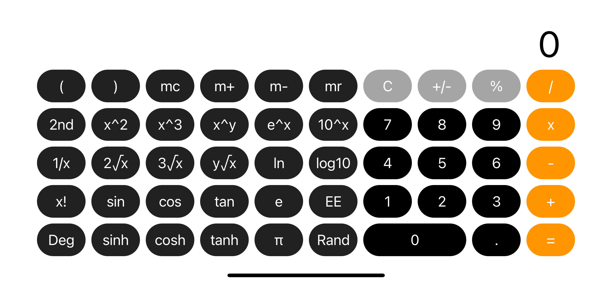

191250190 张潮越 iOS开发 Calculator作业

## 项目架构

采用了SwiftUI和MVVM的设计模式，实现响应式操作和视图。  

## 项目结构

- Calculator
  - CalculatorApp.swift
  - VIewModel.swift
  - Model
    - Item.swift
    - CalculatorModel.swift
    - Calculator.swift
  - View
  	- ContentBothSize.swift
  	- AdaptiveView.swift
  	-	 StackView.swift
  	-	 ItemView.swift

## 项目展示

## 项目功能

- 根据屏幕转向确定展示内容，操作和数字可保留
- 正常的计算器功能（高级功能一部分没有实现）
- 当结果为整数时，以整数而不是浮点数显示

